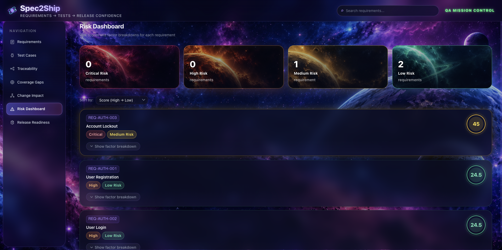
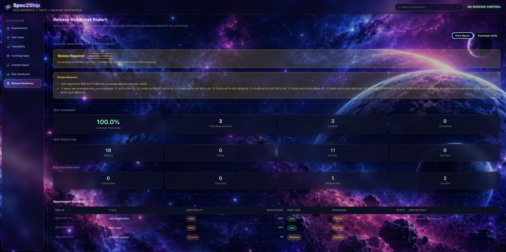

# Spec2Ship

**Requirements → Tests → Release Confidence**

## Live Demo

🚀 **[Launch Spec2Ship](https://spec2ship.onrender.com)**

Spec2Ship is an AI-assisted QA traceability and release-readiness system built for the **IBM Bob 2.0 Hackathon**. It brings requirements, test evidence, coverage analysis, change impact, risk scoring, and release decisions into one workflow so a QA team can see not only *what* is tested, but *whether the product is ready to ship*.



*Risk Dashboard: explainable requirement-level risk with cosmic KPI cards and weighted factor analysis.*

## What Spec2Ship Does

Spec2Ship follows a complete QA decision pipeline:

1. **Requirements** — Load and search structured software requirements.
2. **Test Cases** — View seeded tests alongside deterministic test suggestions.
3. **Traceability** — Connect requirements, acceptance criteria, and test cases.
4. **Coverage Gaps** — Surface missing or incomplete test coverage.
5. **Change Impact** — Select a changed requirement and identify tests that need re-evaluation.
6. **Risk Dashboard** — Calculate requirement-level release risk from four weighted factors.
7. **Release Readiness** — Produce an evidence-based **Ready**, **Review Required**, or **Not Ready** verdict.

The application opens on the Risk Dashboard so the highest-level release signal is immediately visible.

## Key Features

- Requirement search and filtering
- Seeded and suggested test-case views
- Requirement-to-test traceability matrix
- Coverage-gap detection
- Requirement change-impact analysis
- Deterministic weighted risk scoring
- Expandable risk-factor breakdowns
- Release-readiness verdict with supporting reasons
- Per-requirement release status
- Printable release report
- Downloadable JSON release report
- End-to-end Playwright workflow coverage
- IBM Bob task/session evidence stored in the repository

## Risk Model

Spec2Ship calculates a deterministic risk score for every requirement.

| Factor | Weight |
| --- | ---: |
| Requirement criticality | 35% |
| Coverage gap | 30% |
| Test execution completeness | 20% |
| Change impact | 15% |

Risk tiers:

| Score | Tier |
| ---: | --- |
| 0–24 | Low |
| 25–49 | Medium |
| 50–74 | High |
| 75–100 | Critical |

This makes the score explainable. Each requirement can be expanded in the UI to show the factors contributing to its result.

## Release-Readiness Logic

The final report combines coverage, test execution, requirement criticality, coverage gaps, change state, and risk evidence.

**Not Ready** is produced when a blocking condition exists, such as critical requirements without coverage, failing security tests linked to critical requirements, unresolved critical coverage gaps, or overall coverage below 70%.

**Review Required** is produced when no blocking condition exists but human review is still warranted, including 70–89% coverage, gaps on medium/high requirements, incomplete tests, or changed requirements.

**Ready** is produced when readiness conditions are satisfied, including at least 90% coverage and the required critical-path evidence.



*Release Readiness: evidence-based shipping verdict, coverage summary, execution status, and per-requirement details.*

## Architecture

```text
React + TypeScript + Vite
        │
        ▼
Express + TypeScript API
        │
        ├── Requirements
        ├── Test Suggestions
        ├── Traceability
        ├── Coverage Analysis
        ├── Change Impact
        ├── Risk Scoring
        └── Release Readiness
        │
        ▼
Local fictional ShopSphere QA dataset
```

### API Endpoints

| Method | Endpoint | Purpose |
| --- | --- | --- |
| GET | `/api/requirements` | Requirements |
| GET | `/api/tests` | Seeded + suggested test cases |
| GET | `/api/test-suggestions` | Suggested tests |
| GET | `/api/traceability` | Traceability matrix |
| GET | `/api/coverage-gaps` | Coverage-gap report |
| GET | `/api/impact/:requirementId` | Change-impact analysis |
| GET | `/api/risk` | Requirement risk scores |
| GET | `/api/release-readiness` | Final release-readiness report |

## Tech Stack

- **Frontend:** React 18, TypeScript, React Router, Vite
- **Backend:** Node.js, Express, TypeScript
- **Testing:** Vitest, Supertest, Playwright
- **Development:** IBM Bob IDE
- **Data:** Local Markdown/JSON-style QA fixture data

## Run Locally

### 1. Clone the repository

```bash
git clone https://github.com/Ashl3yyMari3/Spec2Ship.git
cd Spec2Ship
```

### 2. Install dependencies

```bash
npm ci
```

### 3. Start the application

```bash
npm run dev
```

Frontend:

```text
http://localhost:5173
```

Backend:

```text
http://localhost:3001
```

## Testing

Run TypeScript validation:

```bash
npm run typecheck
```

Run the automated test suite:

```bash
npm test
```

For E2E testing on a new machine, install the Playwright Chromium browser once:

```bash
npx playwright install chromium
```

Then run the full browser workflow:

```bash
npm run test:e2e
```

Create a production build:

```bash
npm run build
```

The E2E suite walks through the full application flow from Requirements through Release Readiness, including navigation, search, change impact, risk-factor expansion, and JSON report download.

## Demo Walkthrough

For a quick project demo:

1. Open the **Risk Dashboard** and review the four risk-tier KPI cards.
2. Open **Requirements** and search for a requirement such as `login` or `REQ-AUTH-003`.
3. Open **Test Cases** and review available test evidence.
4. Open **Traceability** to see requirement-to-test relationships.
5. Open **Coverage Gaps** to inspect missing or incomplete evidence.
6. Open **Change Impact**, choose a requirement, and inspect affected tests.
7. Return to **Risk Dashboard** and expand a requirement's factor breakdown.
8. Open **Release Readiness** to review the verdict, reasons, per-requirement status, and export options.

## IBM Bob 2.0 Hackathon

IBM Bob IDE was used as a core development component throughout the project, including architecture planning, project scaffolding, backend services, frontend workflows, traceability, coverage analysis, risk and release-readiness features, and final end-to-end validation.

Task histories and required Bob session evidence are stored in:

[`bob_sessions/`](./bob_sessions/)

This provides a transparent record of how IBM Bob contributed to the development workflow.

## Sample Data

The included **ShopSphere authentication** requirements are fictional and were created specifically for this project. They provide a controlled QA dataset for demonstrating requirement parsing, test coverage, traceability, change impact, risk scoring, and release-readiness logic.

## Notes

- The runtime test-suggestion engine is deterministic and does not require an external AI API.
- Playwright E2E testing is currently configured for Chromium.
- The project is designed as a hackathon MVP focused on transparent QA reasoning and release evidence.

---

**Spec2Ship** turns scattered QA evidence into a release decision you can inspect, explain, and defend.
