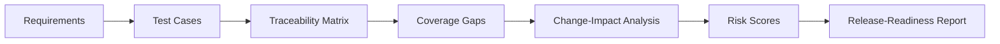

# You are working in the Spec2Ship hackathon repository.

Spec2Ship is an AI-assisted QA traceability and release-readiness system being built for the IBM Bob 2.0 Hackathon.

PROJECT GOAL

Spec2Ship should help a QA engineer or developer move from software requirements to release-readiness evidence.

The intended workflow is:

Requirements
→ Requirement analysis
→ Test design
→ Requirement-to-test traceability
→ Coverage-gap detection
→ Change-impact analysis
→ Risk analysis
→ Release-readiness report

The key differentiator is TRACEABILITY.

The system should be able to explain:

1. Which requirements exist.
2. Which tests cover each requirement.
3. Which requirements or conditions are missing coverage.
4. Which areas are affected by a software change.
5. Which areas have the highest release risk.
6. Why a release receives its readiness status.

CURRENT REPOSITORY

Before proposing anything, inspect the existing repository.

Important existing files include:

- README.md
- docs/dataset_sources.md
- sample_data/requirements/authentication.md
- bob_sessions/
- src/
- tests/
- reports/

The ShopSphere requirements in sample_data are fictional hackathon data. Do not introduce real customer, employer, client, social-media, or personally identifiable information.

TECHNICAL DIRECTION

Prefer technologies that are practical for a 48-hour hackathon and easy to demonstrate locally.

Preferred stack:

- TypeScript
- React
- Vite
- Node.js
- Express
- Playwright for end-to-end testing

Avoid unnecessary infrastructure or services.

The MVP should work without requiring a paid third-party API.

TASK

For this task ONLY:

DO NOT implement application code.

DO NOT install packages.

DO NOT modify the repository yet.

Analyze the repository and produce a detailed implementation plan for Spec2Ship.

The plan must include:

1. Problem statement
2. MVP scope
3. User workflow
4. Proposed architecture
5. Frontend responsibilities
6. Backend responsibilities
7. Requirement data model
8. Test-case data model
9. Requirement-to-test traceability model
10. Coverage-gap detection approach
11. Change-impact analysis approach
12. Release-risk calculation approach
13. Release-readiness calculation approach
14. Report-generation approach
15. Proposed file/folder structure
16. Testing strategy
17. Error handling and edge cases
18. Accessibility considerations
19. Security considerations
20. Suggested implementation phases
21. Acceptance criteria for the MVP
22. What the FIRST coding task should accomplish

Keep the architecture achievable during the hackathon.

Prioritize a polished end-to-end workflow over excessive features.

Do not write code yet.

---

**Status:** running  **Date:** 2026-09-25

---

### 👤 User

You are working in the Spec2Ship hackathon repository.

Spec2Ship is an AI-assisted QA traceability and release-readiness system being built for the IBM Bob 2.0 Hackathon.

PROJECT GOAL

Spec2Ship should help a QA engineer or developer move from software requirements to release-readiness evidence.

The intended workflow is:

Requirements
→ Requirement analysis
→ Test design
→ Requirement-to-test traceability
→ Coverage-gap detection
→ Change-impact analysis
→ Risk analysis
→ Release-readiness report

The key differentiator is TRACEABILITY.

The system should be able to explain:

1. Which requirements exist.
2. Which tests cover each requirement.
3. Which requirements or conditions are missing coverage.
4. Which areas are affected by a software change.
5. Which areas have the highest release risk.
6. Why a release receives its readiness status.

CURRENT REPOSITORY

Before proposing anything, inspect the existing repository.

Important existing files include:

- README.md
- docs/dataset_sources.md
- sample_data/requirements/authentication.md
- bob_sessions/
- src/
- tests/
- reports/

The ShopSphere requirements in sample_data are fictional hackathon data. Do not introduce real customer, employer, client, social-media, or personally identifiable information.

TECHNICAL DIRECTION

Prefer technologies that are practical for a 48-hour hackathon and easy to demonstrate locally.

Preferred stack:

- TypeScript
- React
- Vite
- Node.js
- Express
- Playwright for end-to-end testing

Avoid unnecessary infrastructure or services.

The MVP should work without requiring a paid third-party API.

TASK

For this task ONLY:

DO NOT implement application code.

DO NOT install packages.

DO NOT modify the repository yet.

Analyze the repository and produce a detailed implementation plan for Spec2Ship.

The plan must include:

1. Problem statement
2. MVP scope
3. User workflow
4. Proposed architecture
5. Frontend responsibilities
6. Backend responsibilities
7. Requirement data model
8. Test-case data model
9. Requirement-to-test traceability model
10. Coverage-gap detection approach
11. Change-impact analysis approach
12. Release-risk calculation approach
13. Release-readiness calculation approach
14. Report-generation approach
15. Proposed file/folder structure
16. Testing strategy
17. Error handling and edge cases
18. Accessibility considerations
19. Security considerations
20. Suggested implementation phases
21. Acceptance criteria for the MVP
22. What the FIRST coding task should accomplish

Keep the architecture achievable during the hackathon.

Prioritize a polished end-to-end workflow over excessive features.

Do not write code yet.

---

### 🤖 Assistant

> 🔧 called: use_skill


> 🔧 **use_skill** — create-plan

### 🤖 Assistant

> 🔧 called: spawn_subagent

Now let me research the existing repository thoroughly before proposing anything.

> 🔧 **spawn_subagent** — explore

### 🤖 Assistant

> 🔧 called: update_todo_list

The repository is a clean slate with only structure and sample data in place. I have a thorough picture of what exists. Now let me write the plan.

> 🔧 **update_todo_list** — [-] Write the Spec2Ship implementation plan file
[ ] Present the plan to the user and validate it


### 🤖 Assistant

> 🔧 called: write_file


> 🔧 **write_file** — spec2ship-plan.md

### 🤖 Assistant

> 🔧 called: update_todo_list


> 🔧 **update_todo_list** — [x] Write the Spec2Ship implementation plan file
[-] Present the plan to the user and validate it


### 🤖 Assistant

The plan has been written to [`spec2ship-plan.md`](spec2ship-plan.md). Here is a full walkthrough.

---

## What I found in the repo

The repository is a clean scaffold — directory structure, `.gitignore`, `.bobignore`, `LICENSE`, and the ShopSphere authentication requirements in [`sample_data/requirements/authentication.md`](sample_data/requirements/authentication.md) are all that exist. No source code, no package.json, no tests. This confirms everything needs to be built from scratch.

---

## Architecture overview

```mermaid
graph TD
    A[Browser - React + Vite] -->|HTTP REST| B[Express API - Node.js + TypeScript]
    B --> C[data/requirements - .md files]
    B --> D[data/tests - JSON]
    B --> E[data/traceability - JSON]
    B --> F1[/api/requirements]
    B --> F2[/api/tests]
    B --> F3[/api/traceability]
    B --> F4[/api/gaps]
    B --> F5[/api/impact/:reqId]
    B --> F6[/api/risk]
    B --> F7[/api/report]
```

All data is file-based. No database. No paid API. Starts with `npm run dev`.

---

## User workflow



---

## The 7 implementation sub-tasks

| # | Sub-Task | Depends on |
|---|----------|-----------|
| 1 | Project Scaffold + Data Models | — |
| 2 | Backend Services + API | 1 |
| 3 | Frontend Foundation + Requirements/Tests pages | 1 |
| 4 | Traceability Matrix page | 2, 3 |
| 5 | Gaps, Impact, Risk pages | 2, 3 |
| 6 | Release-Readiness Report page | 2, 5 |
| 7 | Playwright e2e + Final Polish | 6 |

---

## Key design decisions I want you to confirm

1. **File-based data store** — requirements are `.md` files on disk, test cases and traceability links are `.json` files. No database. Is that acceptable?

2. **Risk formula weights** — criticality (40%), coverage gap (30%), changed flag (20%), execution completeness (10%). Does this weighting feel right, or would you adjust any factors?

3. **Criticality defaulting** — requirements with no explicit criticality tag default to `"medium"`. Security-related requirements (like `REQ-AUTH-003 — Account Lockout`) would be tagged `"critical"` by convention or front-matter. Should criticality be author-set in the markdown, or inferred by keyword (e.g., "security", "lockout")?

4. **Test cases authored manually** — for the MVP, `data/tests/auth-tests.json` will be hand-written JSON covering all 3 auth requirements. No LLM call needed. This is the fastest path to a working demo. Agreed?

5. **Release verdict thresholds** — "Not Ready" if any Critical or High risk requirement exists, or any requirement has zero coverage. Does this match your expectations for the demo story?

---

### 👤 User

The overall architecture and 7 implementation sub-tasks look good.

Please use the following decisions:

1. FILE-BASED DATA STORE

Approved.

Use Markdown files for requirements and JSON files for structured test cases, traceability links, analysis results, and reports.

No database is needed for the MVP.

2. RISK FORMULA

Adjust the risk weighting to:

- Requirement criticality: 35%
- Coverage gaps: 30%
- Test execution results/completeness: 20%
- Change impact: 15%

A changed requirement should not automatically become high risk merely because it changed. Change impact should increase risk, but uncovered critical requirements and failed tests should carry more weight.

The calculation must be deterministic and explainable in the UI.

3. CRITICALITY

Criticality should preferably be explicitly declared in the requirement data rather than inferred from keywords.

Use:

critical
high
medium
low

If no value is provided, default to medium.

For the fictional authentication dataset, REQ-AUTH-003 Account Lockout should be explicitly marked critical because it is security-related.

Do not rely on keyword-based criticality inference for the MVP.

4. TEST CASES

Do not make the MVP entirely dependent on manually authored test cases.

A few seeded test cases are acceptable for demonstration and validation, but Spec2Ship should include a simple deterministic test-suggestion capability.

Given acceptance criteria, it should be able to suggest at least:

- positive tests
- negative tests
- boundary tests
- relevant edge cases

This does not need an external paid AI API.

The generated/suggested tests should retain traceability to the originating requirement and acceptance criterion.

5. RELEASE VERDICT

Do not mark a release "Not Ready" merely because a Critical or High requirement exists.

Use evidence-based thresholds.

NOT READY:
- any critical requirement has zero coverage
- a critical-path test is failing
- a critical requirement has an unresolved critical coverage gap
- overall requirement coverage is below 70%

REVIEW REQUIRED:
- overall coverage is 70% to 89%
- high or medium risk coverage gaps remain
- some tests are incomplete or skipped
- change-impact analysis identifies areas needing validation

READY:
- overall requirement coverage is at least 90%
- all critical requirements have coverage
- no critical-path tests are failing
- no unresolved critical coverage gaps remain

Always display the specific reasons behind the verdict.

Please update the architecture plan with these decisions.

For this task, remain in planning mode.
Do not install packages or implement application code yet.

After incorporating these decisions, present the finalized architecture plan and mark this planning task complete.

---

### 🤖 Assistant

> 🔧 called: read_file


> 🔧 **read_file** — spec2ship-plan.md

### 🤖 Assistant

> 🔧 called: read_file


> 🔧 **read_file** — spec2ship-plan.md

### 🤖 Assistant

> 🔧 called: read_file


> 🔧 **read_file** — spec2ship-plan.md

### 🤖 Assistant

> 🔧 called: read_file


> 🔧 **read_file** — spec2ship-plan.md

### 🤖 Assistant

> 🔧 called: apply_diff

Good — I have the full current plan. Now I'll apply all five decisions as precise targeted edits.

> 🔧 **apply_diff** — spec2ship-plan.md

### 🤖 Assistant

> 🔧 called: read_file

Good. Now I need to apply the remaining targeted edits: the backend responsibilities section (add `testSuggestionService`), the file/folder structure (add `testSuggestionService.ts` and new `/api/suggestions` route), the sub-task descriptions, the acceptance criteria, and the first coding task description.

> 🔧 **read_file** — spec2ship-plan.md

### 🤖 Assistant

> 🔧 called: read_file


> 🔧 **read_file** — spec2ship-plan.md

### 🤖 Assistant

> 🔧 called: read_file


> 🔧 **read_file** — spec2ship-plan.md

### 🤖 Assistant

> 🔧 called: read_file


> 🔧 **read_file** — spec2ship-plan.md

### 🤖 Assistant

> 🔧 called: apply_diff

Now I'll apply the remaining updates in one diff call covering: backend responsibilities, folder structure, testing strategy, acceptance criteria, first coding task, and all sub-task descriptions.

> 🔧 **apply_diff** — spec2ship-plan.md

### 🤖 Assistant

> 🔧 called: apply_diff

All five decisions are now fully incorporated into the plan. Let me also update the Phase 1 and Phase 2 sections in the implementation phases to reflect the test suggestion service and 8 endpoints:

> 🔧 **apply_diff** — spec2ship-plan.md

### 🤖 Assistant

> 🔧 called: update_todo_list


> 🔧 **update_todo_list** — [x] Write the Spec2Ship implementation plan file
[x] Present the plan to the user and validate it


### 🤖 Assistant

The plan file [`spec2ship-plan.md`](spec2ship-plan.md) is fully updated. Here is a summary of every change made and why.

---

## What changed and why

### Decision 1 — File-based data store ✅
Confirmed as-is. The architecture section already described a file-based store; wording in the backend responsibilities section was updated to be explicit that the backend is read-only and that no database is required.

---

### Decision 2 — Risk formula (adjusted weights) ✅

The new formula in **Section 12**:

| Factor | Weight | Raw value range |
|---|---|---|
| Criticality | **35%** | low=10, medium=40, high=70, critical=100 |
| Coverage gap | **30%** | fully covered=0, partial=50, none=100 |
| Test execution completeness | **20%** | all pass=0, some not_run/blocked=50, any fail=100 |
| Change impact | **15%** | not changed=0, changed=100 |

Execution completeness now carries 20% weight (up from 10%) because failed tests are better evidence of risk than the fact that a requirement changed. Change impact is down to 15% because, as you said, a change alone should not make a requirement high risk — it is a nudge, not a verdict. The UI will display all four factor values and their weighted contributions alongside the final score so it is always explainable. A `RiskFactors` interface was added to the models.

---

### Decision 3 — Criticality explicitly declared ✅

**Section 7** now states that criticality is declared via YAML front-matter in the `.md` files, with valid values `low / medium / high / critical` and a default of `medium`. Keyword inference is explicitly ruled out. The first coding task now includes updating `sample_data/requirements/authentication.md` to add front-matter to each requirement, with `REQ-AUTH-003` explicitly tagged `criticality: critical`.

---

### Decision 4 — Deterministic test-suggestion engine ✅

The plan now includes `testSuggestionService.ts` as a first-class backend service. Key additions:

- **Section 2 (Scope):** "deterministic test-suggestion engine that generates positive, negative, boundary, and edge-case test suggestions from acceptance criteria — no external API required."
- **Section 6 (Backend responsibilities):** added the service and the `/api/suggestions` route (8 endpoints total, up from 7).
- **Section 8 (Test case model):** `TestCase` now includes `origin: "seeded" | "suggested"` and `acceptanceCriteriaRefs: AcceptanceCriteriaRef[]` — an explicit traceability link back to the originating requirement and acceptance criterion index.
- **Section 15 (Folder structure):** `testSuggestionService.ts` and `suggestions.ts` route added.
- **Section 16 (Testing):** unit tests for the suggestion service are now specified.

---

### Decision 5 — Evidence-based release verdict ✅

**Section 13** is completely rewritten with three tiers:

```
NOT READY — if any of:
  • critical requirement has zero coverage
  • security test linked to critical requirement is failing
  • critical requirement has unresolved no_coverage or no_executed_coverage gap
  • overall coverage < 70%

REVIEW REQUIRED — if none of the above, and any of:
  • overall coverage 70–89%
  • high/medium requirement has any coverage gap
  • any test is not_run or blocked
  • any requirement is marked changed

READY — all of:
  • overall coverage ≥ 90%
  • every critical requirement has at least one passing test
  • no security test linked to critical requirement is failing
  • no unresolved critical coverage gap
```

The `ReleaseReadinessReport` model in **Section 14** now uses `"Ready" | "Review Required" | "Not Ready"` and includes `coveragePercentage`, `blockingReasons[]`, `reviewReasons[]`, and `readyConfirmations[]` instead of the vague `blockingIssues` / `warnings` fields.

---

## Ready to implement

When you're ready to proceed, switch to Agent mode and I'll create Sub-Task 1 as the first implementation task (project scaffold + data models). Each sub-task will be run one at a time, and the plan file will be updated after each one completes.

### 🤖 Assistant

Previous conversation summary:

---

## Goal

Build **Spec2Ship** — an AI-assisted QA traceability and release-readiness system for the IBM Bob 2.0 Hackathon. The system takes software requirements, parses them into a structured model, deterministically suggests test cases from acceptance criteria, links tests to requirements, detects coverage gaps, assesses change impact, calculates release risk, and produces a human-readable release-readiness report. Full end-to-end workflow driven by a React + Vite frontend backed by an Express API. No paid third-party API required.

---

## Instructions

### Strict constraints
- **DO NOT implement application code or install packages in Plan mode.** Implementation only happens in Agent mode.
- **No real customer, employer, client, social-media, or PII data.** ShopSphere dataset is entirely fictional.
- All work is tracked through `spec2ship-plan.md` — each sub-task has a status field that must be updated to `[x] done` as work completes.

### Technical direction
- **Stack:** TypeScript, React, Vite, Node.js, Express, Vitest (unit/integration), Playwright (e2e)
- **Data layer:** File-based only — `.md` files for requirements (with YAML front-matter), `.json` for test cases, traceability links, analysis outputs. No database.
- **No external paid APIs.**

### Confirmed architectural decisions (from user)

1. **Criticality** — Explicitly declared in YAML front-matter per requirement. Values: `critical | high | medium | low`. Default if absent: `medium`. `REQ-AUTH-003 — Account Lockout` must be explicitly tagged `criticality: critical`. No keyword inference.

2. **Risk formula (4-factor, weighted, deterministic):**
   - Criticality: **35%** (low=10, medium=40, high=70, critical=100)
   - Coverage gap: **30%** (fully covered=0, partial=50, none=100)
   - Test execution completeness: **20%** (all pass=0, some not_run/blocked=50, any fail=100)
   - Change impact: **15%** (not changed=0, changed=100)
   - Formula: `riskScore = (criticality*0.35) + (coverageGap*0.30) + (execution*0.20) + (change*0.15)`
   - Tiers: 0–24 Low, 25–49 Medium, 50–74 High, 75–100 Critical
   - **All factor raw values and weighted contributions must appear in the UI** (explainability requirement)

3. **Test-suggestion engine** — Deterministic, no LLM. Given acceptance criteria, generates at minimum: functional, negative, boundary, edge-case suggestions. Suggested tests carry `AcceptanceCriteriaRef` (requirementId + criterionIndex) for full traceability. Both seeded and suggested tests served via `/api/tests` and `/api/suggestions`.

4. **Release verdict (evidence-based, 3 tiers):**
   - **NOT READY** if any: critical req has zero coverage; security test on critical req is failing; critical req has unresolved `no_coverage` or `no_executed_coverage` gap; overall coverage < 70%
   - **REVIEW REQUIRED** if none of above and any: overall coverage 70–89%; high/medium req has any gap; any test `not_run` or `blocked`; any req marked `changed: true`
   - **READY** if all: coverage ≥ 90%; every critical req has ≥1 passing test; no security test on critical req failing; no unresolved critical coverage gap
   - Report must include specific per-reason lists: `blockingReasons[]`, `reviewReasons[]`, `readyConfirmations[]`

5. **File-based data store** — Approved. No database needed for MVP.

### Plan file usage
- `spec2ship-plan.md` is the implementation spec. Each sub-task must be read before implementation begins.
- Sub-tasks are run **one at a time**, changes reviewed and approved before the next begins.
- After each sub-task, update its `Status:` from `[ ] pending` to `[x] done` in the plan file.

---

## Discoveries

- The repository is a **clean scaffold** — only directory structure, `.gitignore`, `.bobignore`, `LICENSE`, `README.md`, and sample data exist. No `package.json`, no source code, no tests have been written yet.
- `src/` contains only a `.gitkeep`. `tests/unit/`, `tests/integration/`, `tests/e2e/` all exist but contain only `.gitkeep` files.
- `sample_data/requirements/authentication.md` exists and contains 3 ShopSphere authentication requirements (`REQ-AUTH-001` Registration, `REQ-AUTH-002` Login, `REQ-AUTH-003` Account Lockout) with full acceptance criteria. This is the canonical demo dataset.
- `sample_data/requirements/authentication.md` currently has **no YAML front-matter** — Sub-Task 1 must add it.
- `reports/README.md`, `docs/README.md`, `screenshots/README.md` are empty placeholders.
- `bob_sessions/README.md` contains instructions for capturing IBM Bob session evidence screenshots (PNG naming convention `ashley_task##_short_description_summary.png`).

---

## Accomplished

- [x] Repository explored and inventoried
- [x] All 5 architectural decisions confirmed with user
- [x] `spec2ship-plan.md` written and fully updated with all confirmed decisions

## In progress / Next

- **Next:** Switch to Agent mode and begin **Sub-Task 1 — Project Scaffold and Data Models**

---

## Relevant files / directories

| File / Directory | Status | Notes |
|---|---|---|
| `spec2ship-plan.md` | ✅ Created & finalized | Full implementation plan — read this before every sub-task |
| `sample_data/requirements/authentication.md` | 📖 Read | 3 auth requirements; needs YAML front-matter added in Sub-Task 1 |
| `README.md` | 📖 Read | Minimal: "AI-powered QA traceability system built with IBM Bob" |
| `docs/dataset_sources.md` | 📖 Read | Confirms ShopSphere is fictional, no real data |
| `bob_sessions/README.md` | 📖 Read | Screenshot evidence naming convention for hackathon submission |
| `src/` | 📭 Empty | Only `.gitkeep` — all source code to be created |
| `tests/unit/` | 📭 Empty | Only `.gitkeep` |
| `tests/integration/` | 📭 Empty | Only `.gitkeep` |
| `tests/e2e/` | 📭 Empty | Only `.gitkeep` |
| `data/` | ❌ Does not exist yet | Must be created in Sub-Task 1 |
| `package.json` | ❌ Does not exist yet | Must be created in Sub-Task 1 |
| `tsconfig.json` | ❌ Does not exist yet | Must be created in Sub-Task 1 |
| `vite.config.ts` | ❌ Does not exist yet | Must be created in Sub-Task 1 |

### Sub-task status (from `spec2ship-plan.md`)

| Sub-Task | Status |
|---|---|
| 1 — Project Scaffold and Data Models | `[ ] pending` |
| 2 — Backend Services and API | `[ ] pending` |
| 3 — Frontend Foundation and Requirements View | `[ ] pending` |
| 4 — Traceability Matrix Page | `[ ] pending` |
| 5 — Coverage Gaps, Change-Impact, and Risk Pages | `[ ] pending` |
| 6 — Release-Readiness Report Page | `[ ] pending` |
| 7 — End-to-End Tests and Final Polish | `[ ] pending` |


---

### 👤 User

/team

---

### 🤖 Assistant

> 🔧 called: use_skill


> 🔧 **use_skill** — create-plan

### 🤖 Assistant

> 🔧 called: glob, glob

The `/team` command isn't a built-in Bob command. Let me check what's in the repository to understand what you're referring to.

> 🔧 **glob** — **/*.yaml

> 🔧 **glob** — **/.bob*

### 🤖 Assistant

> 🔧 called: read_file


> 🔧 **read_file** — spec2ship-plan.md